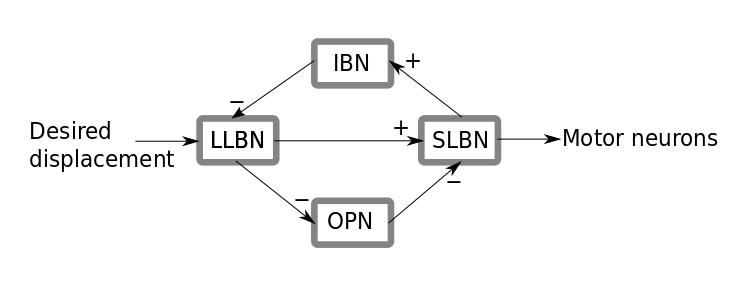
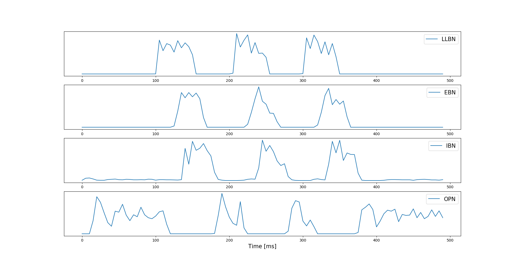
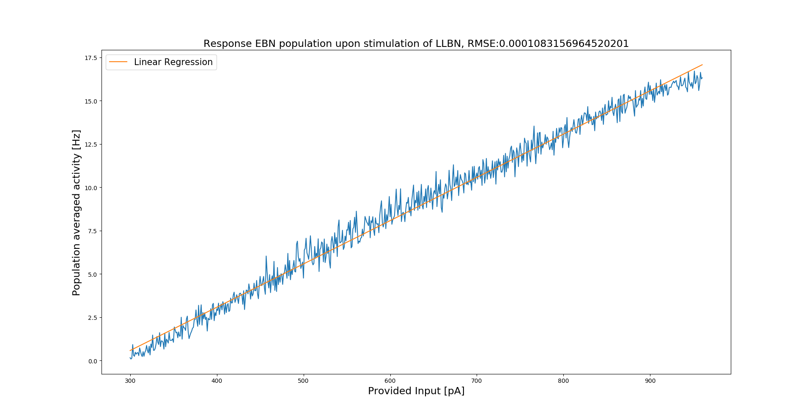
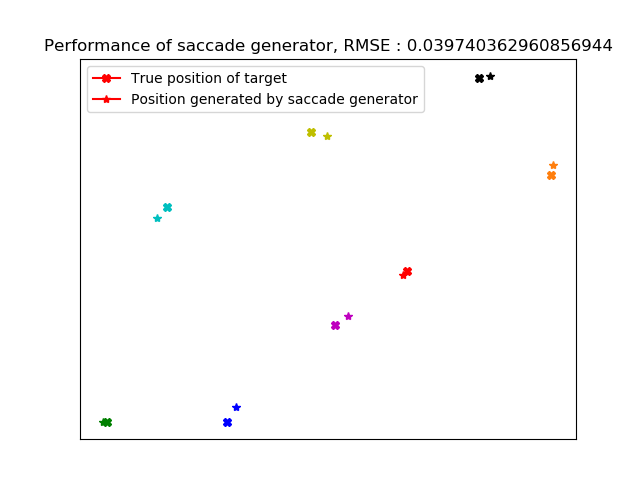

# Spiking Saccade Generator

## Introduction
This repository contains an implementation of a spiking neural network model of the saccade generator in the reticular formation inspired by *A neural model of the saccade generator in the reticular formation* by Gancarz and Grossberg, Neural Networks, 1998.  

The spiking neural network consists of four recurrently connected populations of spiking neurons which are interconnected in a population-specific manner (see figure). 
These populations correspond to populations of neurons found in the reticular formation exhibiting similar responses in electrophysiological experiments (see, e.g., *The brainstem burst generator for saccadic eye movements* by Scudder et al., Exp Brain Res, 2002, for a review) and are believed to play different roles in the saccade generation process. 
The four populations are long-lead burst neurons (LLBN), short-lead burst neurons (SLBN; in turn consisting of recurrently connected excitatory and inhibitory burst neurons), a separate population of inhibitory burst neurons (IBN), and omni-pause neurons (OPN). We refer to the excitatory subpopulation of the SLBN as EBN (excitatory burst neurons).

Electrophysiological studies show that in the time between two saccades the OPN fire regularly and inhibit the EBN. 
Upon initiation of the saccade generation process by a signal to LLBN encoding the desired displacement of the saccadic jump, the LLBN inhibit the OPN and excite the EBN. 
Due to the disinhibition of the EBN via the OPN and the direct excitation, the EBN themselves begin to burst. 
The activity of the EBN is not only passed to the motor neurons but also directed to the IBN, which in turn inhibit the LLBN. 
Due to the absence of inhibition the OPN become active again and deactivate the EBN.
This leads to a reset of the circuit to a state qualitatively identical to the initial one.

The interconnections between the four populations are schematically depicted below:  
  
This fundamental building block takes responsibility for the movement of the eyes in **one** direction, e.g. horizontally left or vertically downwards.
To build a complete saccade generator, one first patches together two of these fundamental building blocks collapsing the two OPN populations into one, thereby obtaining a saccade generator for either horizontal or vertical saccades. 
For the second axis, one just duplicates this circuit.
In the model, the LLBN and the SLBN consist of two interconnected populations of excitatory and inhibitory multi-timescale adaptive threshold model neurons (see *Made-to-order spiking neuron model equipped with a multi-timescale adaptive threshold* by Kobayashi et al., Front Comp Neurosci, 2009) exhibiting bursty behaviour.
The activity of the excitatory subpopulation (EBN) of the SLBN determines the size of the saccades.
The OPN consist of two interconnected populations of excitatory and inhibitory leaky integrate-and-fire neurons.
The IBN consist of one interconnected population of inhibitory multi-timescale adaptive threshold neurons again showing bursty behavior.

The network satisfies Dale's principle and qualitatively takes different neuron characteristics (the distinction between bursting and non-bursting neurons) found in the reticular formation into account.
Our model differs from the one described by Gancarz and Grossberg in the respect that they model the saccade generator with neural populations, i.e. they represent the network with a system of coupled differential equations where each population is described via one of these equations.
Our network, however, is more biologically plausible since it operates with spiking neurons which not only satisfy Dale's principle
but also exhibit bursty dynamics, motivated by the neurons found in the saccade generator.
All simulations were carried out with NEST 2.18 using the PyNEST interface (Jordan et al., NEST 2.18.0. Zenodo, 2019, 10.5281/zenodo.2605422).
## Results
The constructed network exhibits the reset property described above if provided with sustained input.  
  
Moreover, the EBN show a linear response upon sufficiently strong stimulation of the LLBN.  
  
This allows for a linear readout of the activity of the EBN to determine the saccade size.  
Building a complete saccade generator, one obtains the following:  


## Usage
In order to use the saccade generator one needs to first add the base directory to one's PYTHONPATH. If one is in the base directory of the spiking saccade generator, one just needs to execute the following (on a Unix-like system):
```
export PYTHONPATH=$PWD:$PYTHONPATH
```
See **example.py** in /examples for a step by step introduction to the usage, also see the evaluations scripts in /examples/evaluation.
## Requirements
See environment.yml for used Python packages. We used NEST 2.18.0 as simulation engine.

## Contributors
Code written by Anno Kurth with support from Sacha van Albada.

## License
CC BY-NC-SA 4.0 (https://creativecommons.org/licenses/by-nc-sa/4.0/, see License.md).
## References
Gancarz, Gregory, and Stephen Grossberg. "A neural model of the saccade generator in the reticular formation." Neural Networks 11.7-8 (1998): 1159-1174.  
Scudder, Charles A., Chris R. Kaneko, and Albert F. Fuchs. "The brainstem burst generator for saccadic eye movements." Experimental brain research 142.4 (2002): 439-462.  
Kobayashi, Ryota, Yasuhiro Tsubo, and Shigeru Shinomoto. "Made-to-order spiking neuron model equipped with a multi-timescale adaptive threshold." Frontiers in computational neuroscience 3 (2009): 9.
## Acknowledgments
This work was supported by the European Union Horizon 2020 research and innovation program (Grant 737691, Human Brain Project SGA2).
